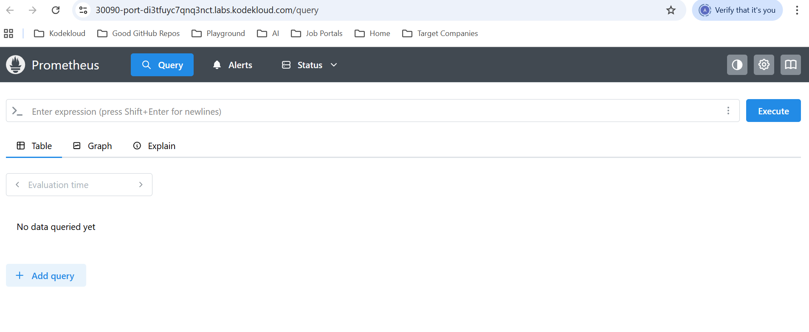
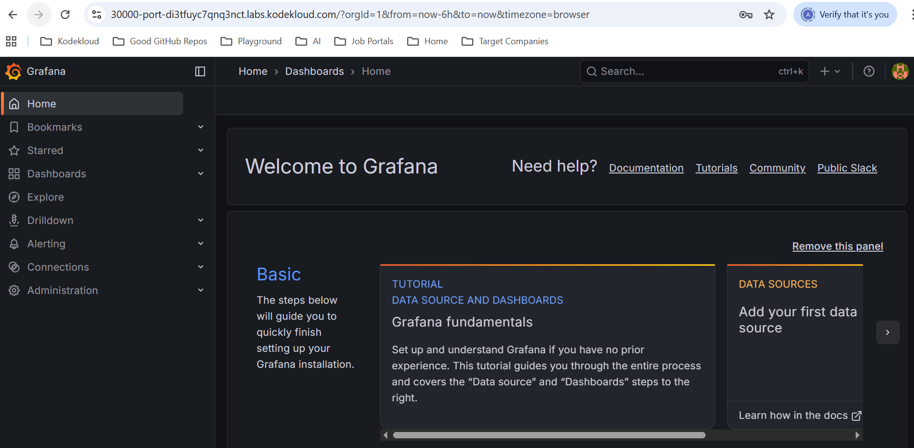
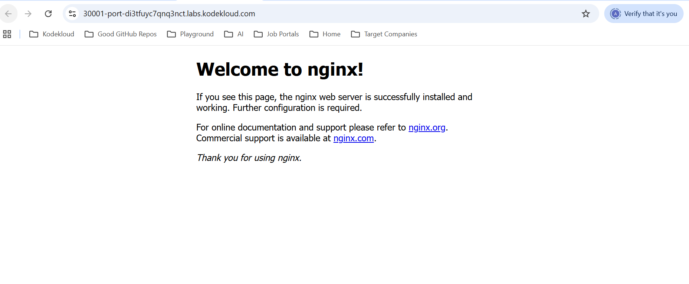
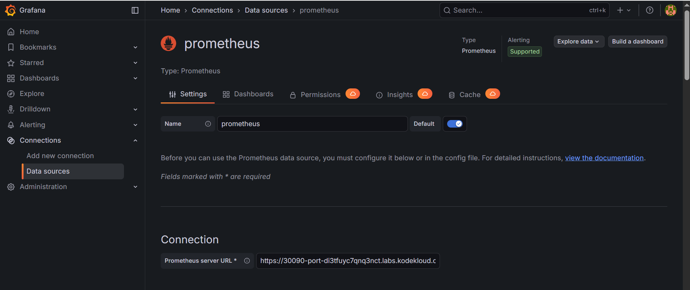
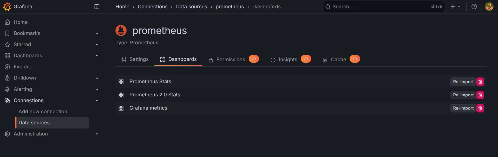
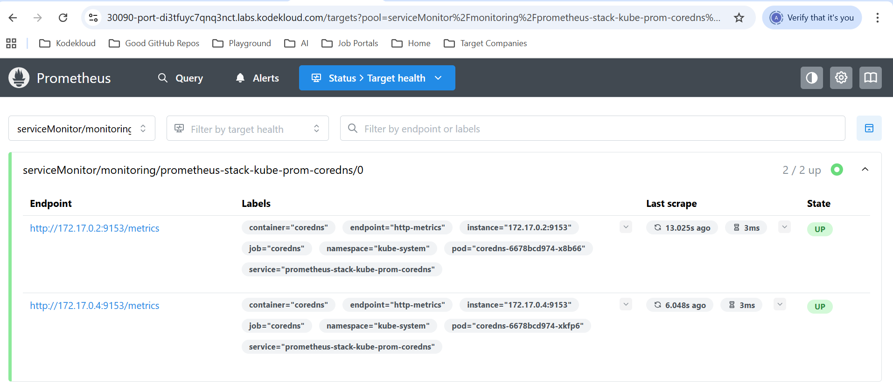

#Kube-Prometheus-Stack













Here is a concise README-style guide you can drop into GitHub for the KodeKloud lab scenario (Prometheus + Grafana + webapp + NodePorts + simple dashboard).

***

# Kubernetes Monitoring with Prometheus & Grafana (KodeKloud Lab)

Minimal setup to deploy:

- Sample web application  
- Prometheus (kube-prometheus-stack)  
- Grafana  
- NodePort access for all UIs  
- Simple Grafana dashboard using Prometheus datasource[1][2]

## Prerequisites

- KodeKloud Kubernetes lab cluster
- `kubectl` configured (points to lab cluster)
- `helm` v3 installed

```bash
kubectl get nodes
helm version
```

## 1. Namespaces

```bash
kubectl create namespace webapp --dry-run=client -o yaml | kubectl apply -f -
kubectl create namespace monitoring --dry-run=client -o yaml | kubectl apply -f -
```

## 2. Sample Webapp

`k8s/webapp.yaml`:

```yaml
apiVersion: apps/v1
kind: Deployment
metadata:
  name: webapp
  namespace: webapp
  labels:
    app: webapp
spec:
  replicas: 2
  selector:
    matchLabels:
      app: webapp
  template:
    metadata:
      labels:
        app: webapp
    spec:
      containers:
      - name: webapp
        image: nginxinc/nginx-unprivileged
        ports:
        - name: http
          containerPort: 8080
---
apiVersion: v1
kind: Service
metadata:
  name: webapp-svc
  namespace: webapp
  labels:
    app: webapp
spec:
  selector:
    app: webapp
  ports:
  - name: http
    port: 80
    targetPort: 8080
  type: NodePort
```

Apply:

```bash
kubectl apply -f k8s/webapp.yaml
kubectl get pods,svc -n webapp
```

In KodeKloud, access webapp at:

```text
https://<webapp-nodeport>-port-<lab-id>.labs.kodekloud.com
```

## 3. Prometheus (kube-prometheus-stack) via Helm

```bash
helm repo add prometheus-community https://prometheus-community.github.io/helm-charts
helm repo update
```

Install:

```bash
helm install prometheus-stack prometheus-community/kube-prometheus-stack \
  -n monitoring \
  --set grafana.enabled=false \
  --set alertmanager.enabled=false \
  --set prometheus.prometheusSpec.serviceMonitorSelectorNilUsesHelmValues=false \
  --set prometheus.prometheusSpec.podMonitorSelectorNilUsesHelmValues=false
```

Verify:

```bash
kubectl get pods -n monitoring
```

### Expose Prometheus via NodePort

```bash
kubectl patch svc prometheus-stack-kube-prom-prometheus -n monitoring \
  -p '{"spec":{"type":"NodePort","ports":[{"name":"http","port":9090,"targetPort":9090,"protocol":"TCP","nodePort":30090}]}}'

kubectl get svc prometheus-stack-kube-prom-prometheus -n monitoring
```

Prometheus URL (KodeKloud):

```text
https://30090-port-<lab-id>.labs.kodekloud.com
```

## 4. Grafana via Helm (separate chart)

```bash
helm repo add grafana https://grafana.github.io/helm-charts
helm repo update
```

Install Grafana with NodePort + anonymous admin (lab only):

```bash
helm install grafana grafana/grafana \
  -n monitoring \
  --set service.type=NodePort \
  --set service.nodePort=30000 \
  --set persistence.enabled=false \
  --set grafana.ini.auth.anonymous.enabled=true \
  --set grafana.ini.auth.anonymous.org_role=Admin
```

Check:

```bash
kubectl get pods,svc -n monitoring
```

Grafana URL:

```text
https://30000-port-<lab-id>.labs.kodekloud.com
```

## 5. Configure Prometheus Datasource in Grafana

1. Open Grafana URL.  
2. Left menu → “Connections” → “Data sources” → “Add data source”.  
3. Choose **Prometheus**.  
4. URL:

```text

https://30090-port-di3tfuyc7qnq3nct.labs.kodekloud.com

```

5. Click **Save & test** (should be “Data source is working”).[3][4]

## 6. Create Simple Grafana Dashboard

1. Left menu → **Dashboards** → **New** → **New dashboard** → **Add a new panel**.[5][6]
2. Ensure datasource is **prometheus** (top of Queries area).  
3. In query box type:

```promql
up
```

4. Click **Run queries** – a graph should appear.  
5. Right side “Panel options” → Title: `Cluster health (up)`.  
6. Click **Apply**, then **Save dashboard** → name `KodeKloud Monitoring`.[7][3]

### Webapp-only panel

1. On same dashboard → **Add** → **Visualization**.  
2. Query:

```promql
up{namespace="webapp"}
```

(or refine with the exact labels seen in Prometheus `up` output).  
3. Title: `Webapp availability`.  
4. **Apply** → **Save**.

## 7. Useful Commands

```bash
# Check all monitoring components
kubectl get all -n monitoring

# Check webapp
kubectl get all -n webapp

# Check Prometheus targets
# (inside Prometheus UI: Status -> Targets)

# Delete everything
helm uninstall prometheus-stack -n monitoring
helm uninstall grafana -n monitoring
kubectl delete ns webapp monitoring
```